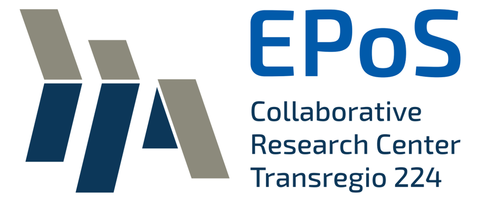
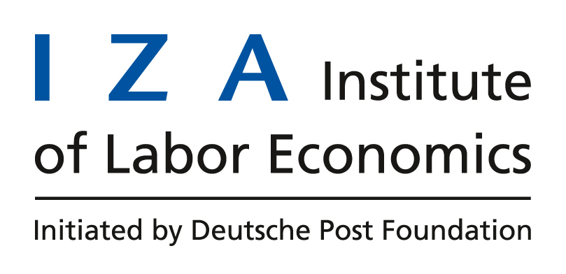

# CoViD-19 Impact Lab

CoViD-19 Impact Lab was started in mid-March 2020 by a group of economists at Bonn and now consists of students and more senior researchers from several institutions like the University of Mannheim, the University of Lausanne, Tilburg University, and the Institute of Labor Economics (IZA).

CoViD-19 and what it means for us personally, our loved ones, the economy, and society in general is on everyone’s mind. To assess how CoViD-19 is impacting individuals, households, and communities, it is important to know what the population as a whole knows, believes, and how people behave in response to the current pandemic. In order to gain insights, we are running a panel data collection in the Netherlands, thereby facilitating near-real-time monitoring of how people respond to the CoViD-19 crisis. On the one hand, we aim to quickly generate first insights from contemporaneous data and communicate them to decision-makers and the public. On the other hand, we will provide in-depth analyses of mechanisms using microeconomic and microeconometric methods.

Our first such paper reveals that the ability to work from home and essential worker status are key predictors of working hours reductions early in the crisis, but much less so in May and June. Current and future work will be featured under *Publications and other Media* on our [website](https://covid-19-impact-lab.readthedocs.io). For further details [explore our data](https://covid-19-impact-lab.iza.org/en/app). The data explorer contains survey results from March 2020 and will soon be updated to include more recent data.

## Supported by

  
  &emsp;

  
  &emsp;

  
  &emsp;

   
   

  
  &emsp;

  
  &emsp;

---

