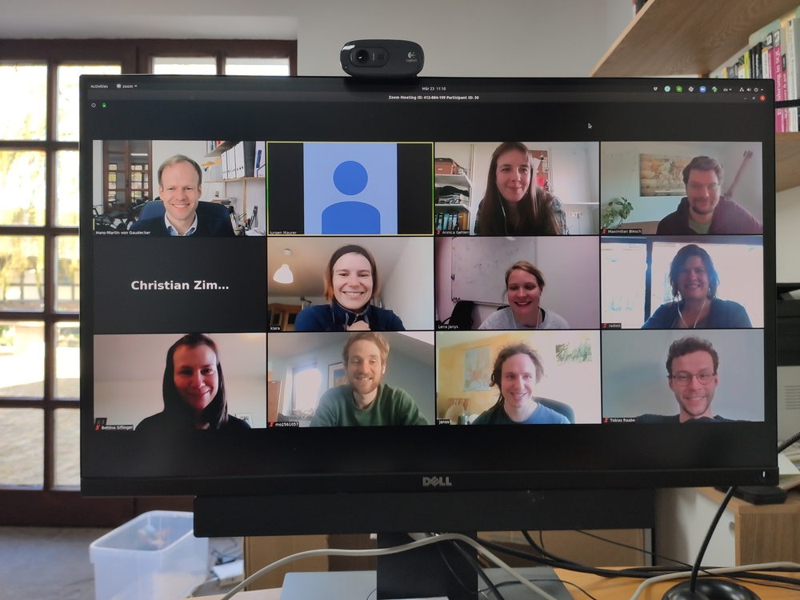

About us
--------

Started in mid-March 2020 by a group of economists at Bonn who are passionate about writing robust code to analyse interesting economic questions, our group comprises ...

Here is a picture from a typical lab meeting:

Distributed the workload across several teams... 

LISS data
=========

Questionnaire Design
********************

* Hans-Martin von Gaudecker
* Radost Holler
* Lena Janys
* Jürgen Maurer
* Moritz Mendel
* Klara Röhrl
* Bettina Siflinger
* Mark Spils
* Renske Stans
* Christian Zimpelmann

Data preparation
****************

too many for me to enumerate, I would not even know... So better not even get started!

Risk perceptions and policies regarding the spread of the disease
*****************************************************************

* Luis Calderón
* Janos Gabler
* Hans-Martin von Gaudecker
* Simon Heiler
* Jürgen Maurer
* Moritz Mendel
* Klara Röhrl

Mental health and biggest worries in the immediate future
*********************************************************

* Moritz Mendel
* Bettina Siflinger

Changes in the work and childcare situation since the onset of the crisis
*************************************************************************

* Lena Janys
* Bettina Siflinger
* Radost Holler
* Christian Zimpelmann

Intended behaviour and expectations
***********************************

* Maria Balgova
* Hans-Martin von Gaudecker
* Ingo Isphording
* Jürgen Maurer
* Moritz Mendel
* Christian Zimpelmann

GESIS data
==========

* Radost Holler
* Rafael Suchy
* Ingo Isphording
* ...

Social Media Sentiment Analysis
===============================

* Janos Gabler
* Jan Knuf
* Tim Mensinger

Coding and Visualisation Wizards
================================

* Janos Gabler
* Christian Hilscher
* Tobias Raabe
* Klara Röhrl
