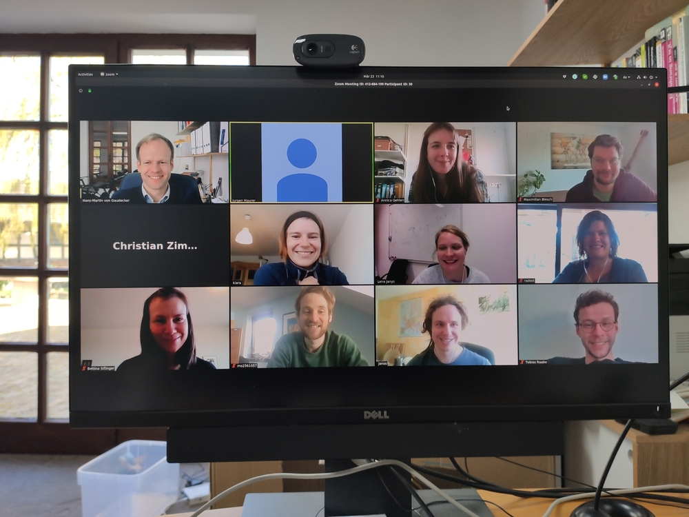

People
--------

Here is a picture from a typical lab meeting:

Active Members
==============

Community Manager
*****************
* `Renata Abikeyeva <mailto:covid-19-impact-lab@outlook.com>`__

Data Collection and Preparation
*******************************
* Hans-Martin von Gaudecker
* Jürgen Maurer (Lausanne)
* Moritz Mendel
* Bettina Siflinger (Tilburg)
* Christian Zimpelmann
* Mariam Petrosyan
* Renata Abikeyeva

Modelling and Data Analyses
***************************
* Maria Balgova (IZA)
* Janos Gabler
* Hans-Martin von Gaudecker
* Simon Heiler
* Radost Holler
* Ingo Isphording (IZA)
* Lena Janys
* Jürgen Maurer (Lausanne)
* Moritz Mendel
* Michaela Paffenholz (Mannheim)
* Klara Röhrl
* Tobias Raabe
* Sebastian Seitz (Mannheim)
* Bettina Siflinger (Tilburg)
* Christian Zimpelmann (IZA)

Data Visualisation
******************
* Janos Gabler
* Klara Röhrl
* Renata Abikeyeva
* Bahar Coskun

Former Contributors
===================

* `Svenja Raabe <https://www.linkedin.com/in/svenjaraabe/>`_ (Color and Logo Design)

* Maximilian Blesch
* Suzanne Bellue
* Luis Calderón
* Christian Hilscher (Mannheim)
* Jan Knuf
* Marc Lipfert
* Tim Mensinger
* Janos Meny
* Omar Salah Ahmed
* Vincent Selz
* Mark Spils (Mannheim)
* Renske Stans
* Rafael Suchy
* Annica Gehlen
* Florens Pfann
* Eva Lucia Kleifgen
* Sofia Badini
* Felipe Azuero
